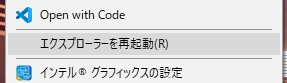
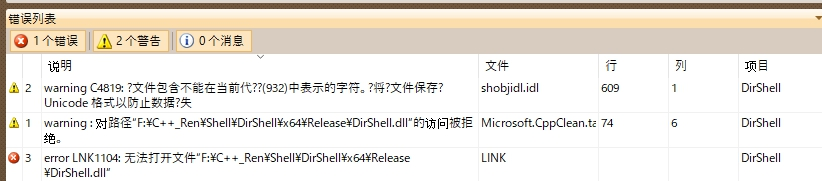

# DirShell (Backup)

+ **This extension is deprecated**, please visit https://github.com/ah-shellext/CopyShell.
+ 菜单添加重启资源管理器
+ 古老 ATL 项目，一堆 ゴミ Code 待改

### Environment
+ MSVC 2010
+ Windows 10 1803 (Build 17134.706)

### Build
```bash
# VS Build
# Find in \DirShell\x64\Release\DirShell.dll

# Register
regsvr32 DirShell.dll
# Find in \HKEY_CLASSES_ROOT\CLSID\{xxxx}
# Result regedit see demo.reg

# Add to HKEY_CLASSES_ROOT\Directory\Background\shellex\ContextMenuHandlers\DirShell
# See DirShell.reg

# UnRegister (Uninstall)
regsvr32 /u DirShell.dll
# Or delete DirShell.dll
```

### ScreenShot



### Tips

+ Key code: `OpenWithDirMenu.cpp`

+ `CLSID` was set in `DirShell.idl`

```cpp
library DirShellLib
{
    importlib("stdole2.tlb");
    [
        uuid(C867A5DD-5B4D-40A9-8C3F-E858E213B573)
    ]
    coclass OpenWithDirMenu
    {
        [default] interface IOpenWithDirMenu;
    };
};
```

+ Link: Normal error (-> restart explorer.exe and won't show popup menu to release dll resource)


